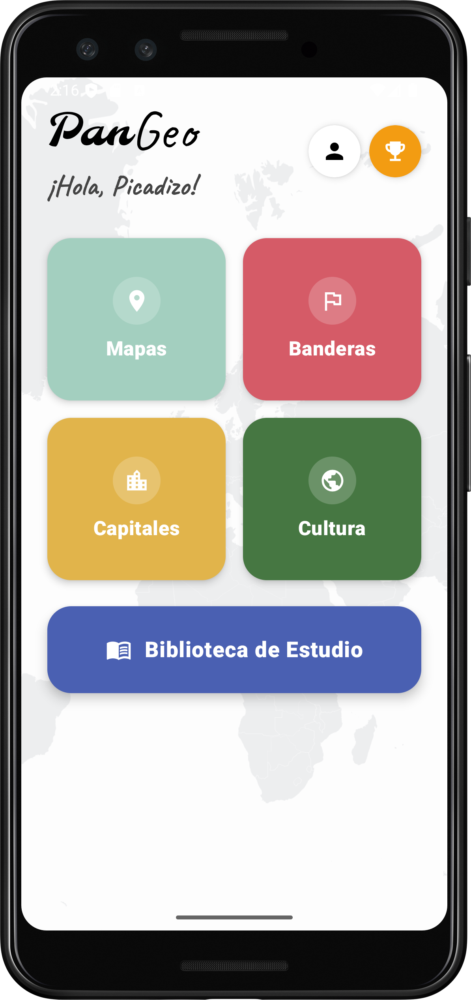
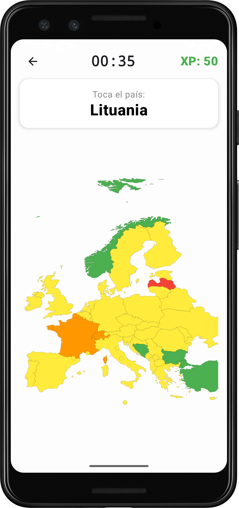
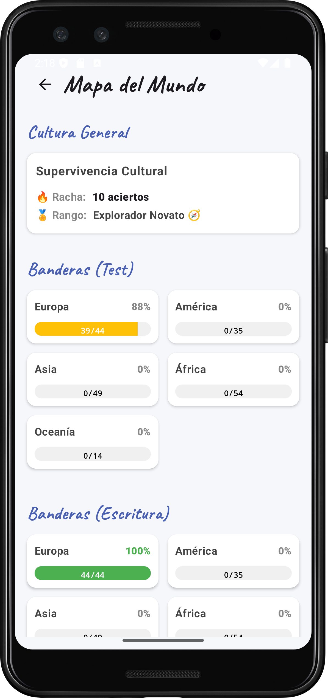

# 🌍 PanGeo

Una aplicación móvil nativa para Android que transforma el aprendizaje de la geografía en una experiencia interactiva y gamificada.

https://github.com/user-attachments/assets/afe76060-23da-4732-8143-36348a3c3447

## 🎯 Sobre el proyecto
PanGeo nace con el objetivo de ofrecer una experiencia de usuario fluida y táctil. A través de mapas interactivos, los jugadores pueden poner a prueba sus conocimientos identificando países de forma visual.

Actualmente, el *Producto Mínimo Viable (MVP)* se centra en el mapa político de Europa, sentando las bases estructurales para una futura expansión a los demás continentes.

## ✨ Características Principales
* *Interacción Táctil Directa:* Integración y manipulación de mapas vectoriales (SVG) en tiempo real.
* *Sistema Gamificado:* Identificación visual de países para un aprendizaje mucho más intuitivo que las clásicas listas de texto.
* *Backend Optimizado:* Uso de estructuras de datos planas para lecturas rápidas y eficientes.

## 🛠️ Tecnologías y Arquitectura
* *Lenguaje:* Kotlin
* *Arquitectura:* MVVM (Model-View-ViewModel)
* *Interfaz y Gráficos:* Mapas interactivos basados en Vector Drawables (SVG)
* *Base de Datos y Backend:* Firebase (Authentication y Cloud Firestore con estructura plana)

## 📸 Capturas de Pantalla

  
  
  

## 👤 Desarrollo
* *Miguel Ángel Ordóñez Picadizo* - Desarrollo integral (UI/UX, Lógica y Backend) - 
